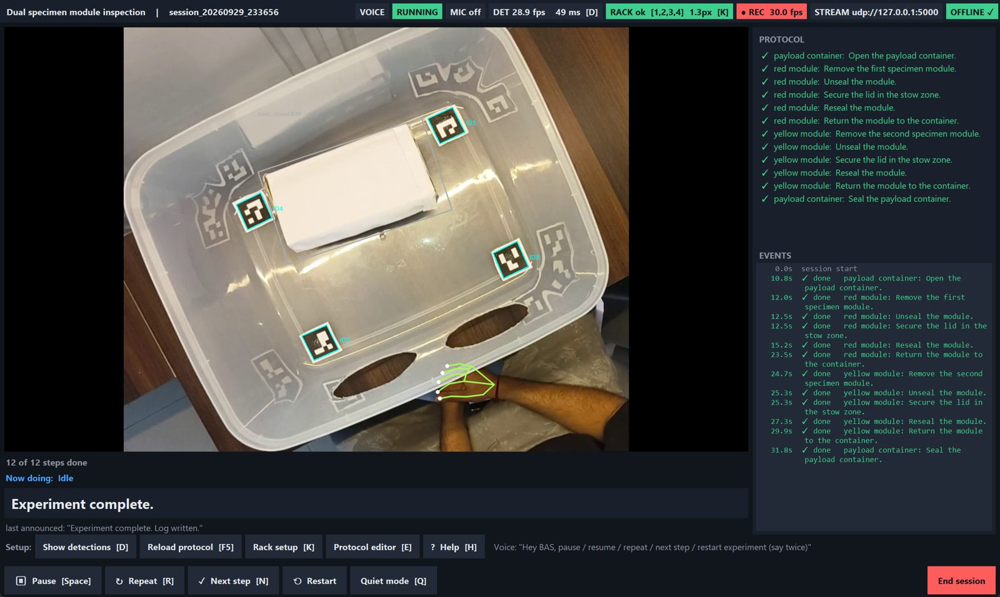
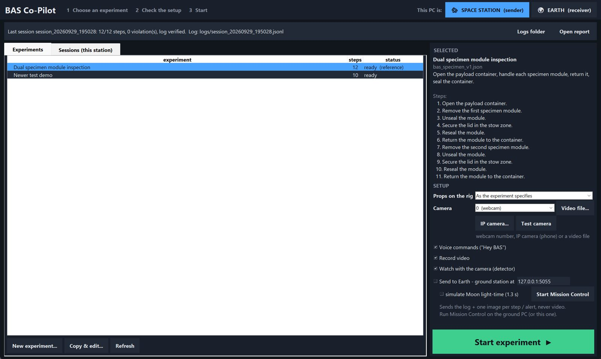
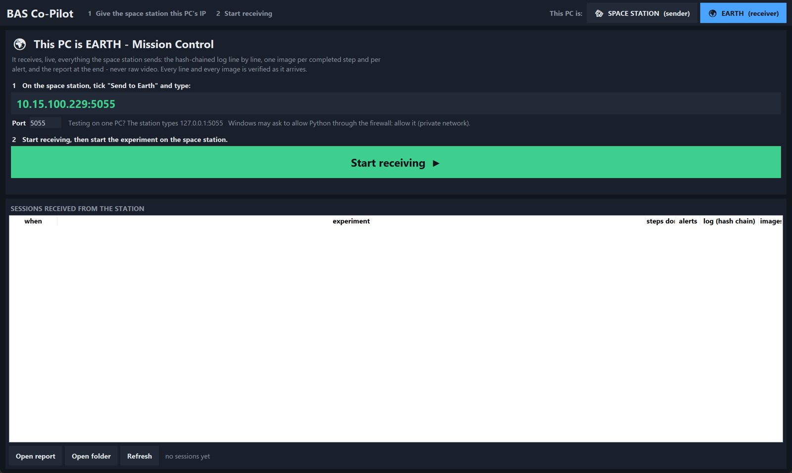
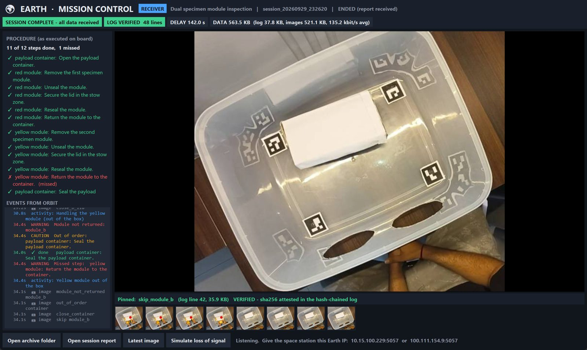

# BAS Co-Pilot

**An offline AI co-pilot for experiments on board the Bharatiya Antariksh
Station.** A fixed camera watches the experiment. The co-pilot tells the
astronaut the next step, gives a voice alert when a step is skipped or done out
of order, and keeps a tamper-evident log that can be sent to Earth later
without sending video.

Smart India Hackathon 2026 · Problem Statement **26174**, *AI Human Activity
Recognition for On-board BAS Experiments* (ISRO / Department of Space) ·
Team **Cheeselayers**



| Runs on | Needs at runtime | Detector (unseen sessions) | Rule scenarios | Downlink per session |
|---|---|---|---|---|
| a laptop CPU | no internet, no GPU | mAP50 **0.89** | **16/16**, 0 false alarms | **486 KB** instead of 3.6 MB video |

---

## Contents

1. [The problem](#1-the-problem)
2. [What we built, against the PS](#2-what-we-built-against-the-ps)
3. [How we built it, start to finish](#3-how-we-built-it-start-to-finish) (15 stages, in order)
4. [Quick start](#4-quick-start)
5. [Using it](#5-using-it)
6. [Connecting the station and Earth](#6-connecting-the-station-and-earth)
7. [Measured results](#7-measured-results)
8. [Limits](#8-limits)
9. [For developers](#9-for-developers)
10. [Documents](#10-documents)

---

## 1. The problem

On a space station, nobody on the ground can watch an experiment as it
happens. Signals are delayed, and the link is too narrow to carry video. The
astronaut still has to follow every procedure exactly. The problem statement
asks for an **on-board, offline, CPU-only** system that:

- follows a pre-defined experiment
- suggests the next step
- alerts by voice on a skipped or out-of-sequence step
- writes a lightweight timestamped log
- streams and stores video
- shows a monitoring GUI

**Our sample experiment** is based on the problem statement's example, *"a box
that contains two smaller boxes, red and yellow"*. It has 12 steps:

```
open container ─┬─► red module:    take out → unscrew cap → put cap down → screw back → return ─┬─► close container
                └─► yellow module: take out → unscrew cap → put cap down → screw back → return ─┘
```

The two modules can be done in either order, but only one can be out at a time.

**Our approach, in one line:** a small trained detector finds the objects,
classical geometry turns boxes into facts, and a deterministic rule engine
decides what is right or wrong. There is no neural network in the alert
path, so it cannot make up a step.

---

## 2. What we built, against the PS

| The PS asks for | What we built |
|---|---|
| Continuously track the experiment from local video | Our detector, plus fusion into step events, plus a constraint-graph procedure checker, all live |
| Suggest the next step at the start and after each step | Spoken aloud (Piper, offline) and shown as a big **NOW** bar |
| Voice alert for a skipped step, or a step added out of sequence | `skip`, `out_of_order`, `wrong_object`, `extra_step` and more: one spoken alert per mistake |
| A timestamped, structured, lightweight text log | Hash-chained JSONL log (tamper-evident) plus a readable `report.txt` for each session |
| Stream the video to an IP and store it locally | One H.264 encode feeds both: MPEG-TS segments on disk and a UDP stream to a configurable IP |
| A GUI for monitoring | The crew screen on the station, plus a **Mission Control** screen for Earth |
| Dataset for object detection, pose and hand-object interaction | 102 videos we recorded, frames extracted, 1,032 whole frames labelled by hand. Hand pose uses MediaPipe; the hand-object rules are ours |
| A trained model running offline on a standalone system | Our YOLOv8n-OBB detector (ONNX) on a laptop CPU, packaged as a Windows `.exe` |
| *Optional:* orientation-agnostic tracking | Not full-body 3D pose. ArUco markers map the camera image onto the rig floor instead (see [Limits](#8-limits)) |

---

## 3. How we built it, start to finish

Each stage below lists what we did, the script or file that does it, and what
came out of it.

### Stage 1: Design the rules before any video
*Phase 0: no camera, no model, just logic that can be tested.*

1. **Safety rules as configuration.** `configs/defaults.yaml` holds every
   safety rule. An experiment inherits them, in three tiers:
   - *Physical impossibilities*, which can never be disabled. For example, a
     module cannot leave a closed container.
   - *Non-overridable safety rules*: the container must be empty before it
     is closed, and there must be no loose objects.
   - *Overridable rules*: one module at a time, sealed before return, cap
     stowed, attended while open, out of order, skip, wrong object, extra
     step and step time limit.

   Every rule carries a written `basis`.
2. **The experiment as data.** `configs/protocols/bas_specimen_v1.json` lists
   only the steps, and `configs/protocol.schema.json` validates its shape.
   - **Order comes only from `after` dependencies.** Groups do not force
     order.
   - **A step whose `condition` is false does not exist for that run.** For
     example, cap steps disappear for props that have no cap.
3. **Loader and validator.** These are `src/protocol/loader.py` and
   `scripts/validate_protocol.py`.
   - **At start-up it prints the resolved rule set**, marking each rule
     `[default]` or `[protocol]`, so nothing is enforced silently.
   - **It rejects a protocol, with line numbers, when:**
     - an `after` reference is broken
     - there is a dependency cycle
     - a role is not bound to a prop
     - a zone is given in image coordinates
     - the protocol uses colour or shape words
     - a rule has no `basis`
     - a non-overridable rule is disabled
     - a step can never be reached
4. **The procedure checker.** `src/protocol/engine.py` is a constraint graph
   that tracks the *set of steps allowed next*, not a position in a list. It
   takes in events and puts out step completions and violations.
   - **The astronaut is always in charge.** It alerts once, logs, and
     carries on. It never blocks.
   - It supports operator override, resuming a session from its log, and
     reloading the protocol while running.
5. **Debouncer.** `src/protocol/debounce.py` requires k-of-n frame agreement
   before any state change.
6. **Alert policy.** `src/protocol/alerts.py` speaks **one alert per root
   cause**, with an 8 s cooldown and at most 4 alerts a minute. The log keeps
   everything. Severity tiers:

   | Tier | Output |
   |---|---|
   | advisory | tone only |
   | caution | tone and speech |
   | warning | tone and speech, and it interrupts |

7. **Hash-chained log.** `src/logging/session_log.py` writes one JSON line
   per event. Each line has UTC and monotonic time (taken at frame capture),
   the step, the event, confidence and the geometry status, plus the hash of
   the previous line. A verifier walks the chain.
8. **Kinematics as pure functions.** `src/kinematics/` covers the One Euro
   filter, motion, grasp, drift, intent, cap state and the tracker states,
   all unit-tested on synthetic trajectories.
9. **Replay harness.** `harness/` has `--stub-detector` and 16 hand-written
   scenarios: clean run, skipped step, wrong object, out of order, two
   modules out at once, a cascade from one root cause, pause, time limit and
   more. `harness/run_all.py` is our headline correctness metric.

### Stage 2: Record our own videos

We found no public dataset of this task, so we recorded our own:
**102 videos** over **6 recording sessions**. They are unscripted: people did
the steps naturally, mistakes included.

| Session | Clips | Setup |
|---|---|---|
| S00 | 48 | first rig, jars; 16 clips with white latex gloves |
| S01 | 6 | a second person's setup, different viewpoint |
| S02 | 8 | slab props (no caps) |
| S03 | 9 | slab props |
| S04 | 11 | overhead tub rig, jars, bare hands |
| S05 | 20 | the demo rig: tub, jars, **4 ArUco markers** on the floor |

The clips are 30–58 s long, most at 30 fps, and some are portrait or have a
variable frame rate. Raw video stays out of git (`clips/`, `clips_Aruco/`).

### Stage 3: Normalise the videos

`scripts/normalize_clips.py` does four things to each clip:
- converts variable frame rate to a constant 30 fps
- detects portrait clips and rotates them to landscape
- strips the audio
- prints a per-clip change table

Rotation guesses without metadata are flagged, and a human confirms them in
`manifest/rotation.csv`. The output goes to `clips_norm/`.

### Stage 4: Extract frames

`scripts/extract_frames.py` samples each clip at 2.5 fps and drops
near-duplicates: consecutive frames within a dHash Hamming distance of 6. The
far-view S04 rig needs a threshold of 3, set in
`manifest/extract_overrides.csv`.

Frames are named `{clip}_{frame:06d}.jpg`. The result is **3,682 frames** in
`frames/`.

### Stage 5: Human review of every clip

`scripts/build_review_sheet.py` makes contact sheets (6 thumbnails per clip,
`manifest/review_sheet_*.png`) and `manifest/clips.csv`, which has three kinds
of column:
- **measured:** duration, fps mode, orientation, lighting
- **guessed, with a confidence score:** prop family, cap type, gloves,
  camera angle
- **left blank for a human:** the session id

A human filled in the session id for every clip and corrected the guesses.
The session id can't be seen in a picture, and it decides the train/test
split.

### Stage 6: Decide the classes, with evidence

**The class-list check.** `scripts/separability_check.py` put 40 ambiguous
frames on one sheet. The rule we used: **a class must be answerable from
appearance in a single frame**. Anything about *position* or a *continuum* is
geometry instead.
- `module_in_case` / `module_free` were **rejected**. A jar's top looks the
  same inside and outside the box. Whether it is inside is a question of
  position, so geometry answers it.
- `case_half_open` was **rejected**, because how open the container is is a
  continuum. Cap state is also computed from box geometry, never labelled.

**The glove test.** `scripts/test_mediapipe_gloves.py` found that MediaPipe
finds white latex gloves far less often than bare hands (26% vs 79% in the
first test). So `hand` was split into `hand_gloved` and `hand_bare`.

**Final 8 classes:**

| Container | Modules | Caps | Hands |
|---|---|---|---|
| `case_open` · `case_closed` | `red_module` · `yellow_module` | `red_lid` · `yellow_lid` | `hand_gloved` · `hand_bare` |

The rules for labellers are in `configs/objects/LABELLING_GUIDANCE.md` and
`LABELLING_RULINGS.md`. The main ones:
- **Oriented (rotated) boxes** throughout.
- **Box a module's full extent.**
- **Box a cap whenever it is visible**, by its own colour, never the colour of
  what it sits on.
- **Label each hand gloved or bare separately.**

### Stage 7: Label by hand

- **Tool:** Label Studio, serving the local `frames/` folder.
- **Every label is a whole camera frame, with every object in it boxed.**
  There are no cropped objects.
- **Labelled in batches** (`labels/batch-1` … `batch14`). After the first
  model existed, each new batch was chosen deliberately:
  1. `scripts/autolabel_remaining_frames.py` pre-labels the unlabelled frames.
  2. `scripts/build_review_priority.py` ranks them by the weakest classes.
  3. `scripts/select_label_batch.py` / `select_lid_confusion_batch.py` pick
     the next batch.
  4. A human corrects every pre-label.
- **Duplicates removed.** Overlapping exports are de-duplicated in
  `labels/dedup/`, and the converter refuses duplicates. There are 0
  near-duplicate frames across sessions (dHash ≤ 3).
- **Result: 1,032 hand-checked whole frames.**

### Stage 8: Build the dataset and split it by session

- **Convert.** `scripts/convert_labels_to_yolo_obb.py` turns the Label Studio
  exports into YOLO-OBB format. A frame marked "reviewed, nothing in it"
  counts as a real negative.
- **Split.** `scripts/split_yolo_dataset.py` (and `scripts/split.py`) split
  **by recording session, never by frame**. It fails hard if a session lands
  on both sides.

| Split | Frames | From |
|---|---|---|
| Train | 715 | S00 (except 9 clips), S02, S04 |
| Test, unseen sessions | 205 | S01 and S03, which were **never trained on** |
| Test, same session | 112 | 9 whole S00 clips; this overestimates, so it is reported separately |
| Test, demo rig | 0 labelled yet | S05 |

A leakage check compared each test frame with its most similar training frame
(1 = identical). S01 scored 0.39 (nothing like training) and S03 scored 0.70
(its closest match is S02, the same slab setup).

### Stage 9: Train the detector

- **Model:** YOLOv8n-OBB, starting from the public `yolov8n-obb.pt` weights.
  It is small and fast, and its oriented boxes follow tilted objects.
- **Script and data:** `scripts/train_yolo_obb.py`, trained on **every
  labelled frame from the training sessions**: 715 whole camera frames, with
  the other 317 of the 1,032 held back for testing. It ran for 120 epochs on a
  GPU in a separate training environment.
- **Augmentation** (`configs/training/augment_v4.yaml`,
  `scripts/photometric_aug.py`): a new random variant of each image every
  epoch:
  - rotation up to **180°** (there is no "up" in microgravity)
  - vertical and horizontal flips, scale and translate
  - blur, contrast, CLAHE, sharpen, noise and JPEG compression
- **Colour:** hue shifts are kept tiny and grayscale is never used, because
  red and yellow are told apart by colour alone. A test enforces this.

**Versions, each measured on the same unseen frames:**

| Version | What changed | Result | Kept? |
|---|---|---|---|
| v1–v3 | first models, trained in the sanity runs | v3: mAP50 0.67 (on the older S01–S03 split) | no |
| v4 | augmentation above, more labels | 0.73 on that split; **0.77** on S01+S03 | no |
| **v5** | 1,032 labels, three sessions in training | **0.89** on S01+S03 | **yes, live** |
| v6p | also trained on **1,197 more frames, labelled by v5 itself** | 0.896 vs 0.892 | no, no difference |
| v6 | 99 frames aimed at cap/module confusion | 0.897 vs 0.892, within noise | no |

**Using more frames made no difference.** In v6p we added 1,197
more whole frames from the training side, labelled by v5 itself (confidence
0.5 or more; test frames excluded), and it scored no better than v5. So more of the same frames does not help; the next gain
has to come from new situations, such as labelling the demo rig (S05).

**Evaluation tools:**
- `scripts/compare_detectors.py`: two models on the same frames
- `scripts/detector_report.py`: per-class report
- [models/README.md](models/README.md): every version's numbers

### Stage 10: Make it fast on a CPU

- **Export to ONNX.** The model was exported to ONNX and runs on
  **onnxruntime and numpy alone**, with no torch at runtime.
- **Same output as the training library.** Across 351 frames, confidence
  and box corners differed by 0 from Ultralytics running the same file.
- **Speed:** 23 ms per image (benchmark), against 35.6 ms for the PyTorch
  weights.
- **Threads** are capped, so the detector and speech don't fight over cores.

### Stage 11: Turn boxes into step events (fusion)

`src/perception/fusion.py` turns detections into events such as *container
opened*, *red module removed*, *cap off*, *cap stowed*, *cap on*, *module
returned* and *container closed*.

- **Voting and hold time.** A new state needs a **k-of-n vote** and a
  **minimum hold time**. These were swept on the tuning clips, not on a
  single clip:

  | Object | Hold time |
  |---|---|
  | container | 1.0 s |
  | module | 0.5 s |
  | cap | 0.3 s |

  A live test with a hand-held phone flickered 62 times; the hold time cut
  that to 30.
- **Caps.** A cap is *off* when its box leaves the module's box, and *on*
  when every cap box is back on the body.
- **Objects not in the experiment** produce an "anomaly" notice, not a
  violation.
- **Deliberately slow.** A step registers about 1 s after it happens, which
  stops flicker from causing false alarms.

### Stage 12: Hands and the rig

- **Hand skeletons.** `src/perception/hand_pose.py` runs the MediaPipe hand
  model in its own thread, in video mode, at no cost to detector speed.
  - A skeleton appears on 94–97% of bare hands, and skeletons that land on
    gloved hands are removed.
  - **"Holding"** comes from the fingertips: 95% while a jar is out, 4% while
    it is in the box.
  - A reach hint is shown on screen but never spoken.
- **Activity line.** `src/runtime/activity.py` gives *"Now doing: handling
  the red module cap"*. It is rules built on holding and fusion state, not a
  trained activity model.
- **ArUco rig.** `src/perception/rack.py` reads four markers
  (DICT_4X4_50, IDs 1–4, 49 mm) and maps the image onto the rig floor
  (a homography). Calibrate it with `scripts/calibrate_rack.py`, which writes
  `configs/rack.yaml`, or live with key **K**.
  - Median reprojection error is 1.0 px, and markers are found up to 50° tilt.
  - Checking containment in rig space tied with image space (17/18 each), so
    it is **off by default**.

### Stage 13: Test the whole pipeline on real clips

- **Fixtures.** Hand-checked expected timelines for real clips are in
  `harness/clip_fixtures/`. They were drafted from 1 fps frame strips
  (`scripts/build_timeline_strip.py`) and checked by a human.
- **Replay.** `scripts/replay_clip.py` runs a clip through the full pipeline
  and compares the result with the fixture.
  - **17 of 18** events on 3 demo-rig clips.
  - **11 of 13** on 2 clips from another person's setup.
- **Other checks.**
  - `scripts/score_perception.py` and `score_hand_cues.py` score perception
    against physical-action fixtures.
  - `scripts/compare_geometry.py` compares image vs rig geometry.
  - `scripts/voice_test.py` tests the wake phrase.

### Stage 14: The app around it

Phase 2, `src/runtime/`:

- **Capture.** One newest frame at a time, with a timestamp taken at capture.
  Queues are bounded and drop old frames.
- **Voice out.** Piper text-to-speech, with every phrase pre-rendered when
  the protocol loads (0.4–0.9 s each), plus short tones (earcons).
- **Voice in.** Vosk, restricted to a fixed set of phrases: *"Hey BAS" +
  next step / repeat / pause / resume / quiet mode / voice mode / restart
  experiment*.
- **Recording and stream.** One H.264 encode writes MPEG-TS segments, which
  survive a crash, and sends a UDP stream.
- **Crew GUI (Tkinter).** Live video, checklist, NOW bar, events, health
  badges, **protocol editor [E]**, rig setup [K] and help [H].
- **Start screen.** Choose the role (Space station or Earth), experiment,
  props, camera (webcam, IP camera with a test preview, or a video file) and
  the Earth link.
- **Session report.** `src/logging/report.py` writes `report.txt`.
- **Earth link.** `src/link/` sends the log line by line and one JPEG per
  step or alert, and resends after a drop. Each photo's sha256 is written into
  the chain. Mission Control is `src/link/ground_gui.py`. **Send later** is
  in the Sessions tab, or `scripts/send_to_earth.py`.
- **Offline guard.** `src/runtime/offline.py` refuses every connection or
  name lookup outside the local network, except the Earth address. Camera
  URLs must be local IPs. In a full live run it blocked 0 attempts.
- **New rules added to close PS gaps:**
  - `extra_step`: an action no remaining step asks for. If it is undone
    within 3 s it is only logged.
  - `step_time_limit`
  - `attended_while_open`: an open module with no hands in view for 5 s.

### Stage 15: Package it

`scripts/build_app.py --zip` uses PyInstaller to build `dist/BAS-Copilot/`,
with `BAS-Copilot.exe`, editable `configs/` and all models inside. There is
no Python or torch on the target machine.

The folder is 674 MB and the zip about 325 MB. Packaging did not slow the
detector (10.8 vs 11.7 det-fps on the same clip).

---

## 4. Quick start

### Option A: the Windows app (no Python needed)

1. Get **`BAS-Copilot-windows.zip`** (≈ 325 MB). Download it from this
   repository's [Releases](../../releases) page if a release is published, or
   build it yourself with `scripts\build_app.py --zip`.
2. Unzip it and double-click **`BAS-Copilot.exe`**. `README.txt` inside is a
   one-page guide.

**Needs:** Windows 10/11 · 8 GB RAM (about 3 GB free while running) · a webcam,
a phone used as a camera, or a recorded video · speakers · a microphone for
voice commands.

### Option B: from source (Windows tested; macOS/Linux untested)

```
py -3.13 -m venv .venv
.venv\Scripts\python.exe -m pip install -e ".[vision,audio,dev]"
.venv\Scripts\python.exe -m pip uninstall -y opencv-python
.venv\Scripts\python.exe -m pip install --force-reinstall --no-deps opencv-contrib-python==5.0.0.93
.venv\Scripts\python.exe scripts\run_gui.py
```

The two OpenCV lines keep the ArUco module working. You don't need a camera to
try it: pick **Video file…** on the start screen.

---

## 5. Using it

### 1. Choose a role

| **SPACE STATION** (sender) | **EARTH** (receiver) |
|---|---|
|  |  |
| Runs the experiment: camera, detector, voice, log | Runs Mission Control: shows its own IP and receives sessions |

### 2. Set up (space station)

1. **Experiment:** pick one, and its steps appear. Any experiment that fails
   the validator is shown with its problems and cannot start.
2. **Props on the rig:** jars with screw caps, slabs without caps, or a mix.
   The same procedure adapts: for example, cap steps disappear for slabs.
3. **Camera:** a webcam number, **IP camera…** (DroidCam, IP Webcam, RTSP, or
   a custom address, with a **Test** preview), or **Video file…**.
4. Optionally tick **Send to Earth**, enter the address, and tick **simulate
   Moon light-time (1.3 s)**.
5. Press **Start experiment**.

### 3. During the session

The badges show live health: RUNNING / PAUSED, MIC, detector fps, RACK, REC,
EARTH, OFFLINE.

| Alert | When |
|---|---|
| Skipped step | a later step happens before an earlier one it depends on |
| Out of order | a step done before the step it must follow |
| Wrong object | the right action on the wrong module |
| Extra step | an action no remaining step asks for, such as taking a returned module out again |
| One module at a time | a second module taken out while the first is still out |
| Module returned unsealed | a module returned without its cap on |
| Container closed with a module outside | the container sealed with work left undone |
| Open module left unattended | no hands in view of an open module for 5 s |
| Step taking too long | an optional per-step time limit runs out |

| Say (offline, whole phrase only) | Key | Does |
|---|---|---|
| *Hey BAS, next step* | N | marks the current step done (logged as operator-confirmed) |
| *Hey BAS, repeat* | R | repeats the current prompt |
| *Hey BAS, pause* / *resume* | Space | pauses or resumes guidance |
| *Hey BAS, quiet mode* / *voice mode* | Q | alerts only (a soft tick per step), or full speech |
| *Hey BAS, restart experiment* (twice within 8 s) | | new session and log |
| | D / K / E / F5 / H | detections · rig setup · protocol editor · reload protocol · help |

### 4. After the session

**End session** shows whether the log verified. You can then:
- **Open report** to read `report.txt`.
- Use the **Sessions** tab to see every run with its log check (*verified*
  or *BROKEN*). Select one and press **Send to Earth** to send it later.

Files are saved in `logs/`, `recordings/<session>/` and, on Earth,
`ground_archive/<session>/`.

### 5. Change the experiment without code

Press **E** during a session to open the protocol editor. With it you can:
- add or reorder steps and groups, and set each step's `after`
- give a step a time limit, or make it optional
- switch each rule on or off, and change its severity and spoken alert
  (safety-critical rules are locked)

**Save** runs the validator, and the running session switches to the new file
without a restart. The same checks are available from the command line:
`scripts\validate_protocol.py <file>`.

---

## 6. Connecting the station and Earth

The station sends to **an IP address you type in**, on port 5055. Earth runs
the app with **EARTH** chosen, or `scripts\ground_station.py`, which needs only
Python and Pillow.

| Setup | Earth address to type | Good for |
|---|---|---|
| Both roles on **one PC** | `127.0.0.1` | trying it out, one-laptop demos |
| Two PCs on the **same Wi-Fi or phone hotspot** | Earth's LAN IP, e.g. `192.168.x.x` | a venue demo; the hotspot needs no mobile data |
| Two PCs in **different places** | Earth's address on a private VPN, such as Tailscale's `100.x.y.z` | remote testing; needs internet at both ends |
| **No link at all** | leave **Send to Earth** unticked | the normal case on a station; send later from the Sessions tab |

- **Type the number, not a hostname.** The offline guard blocks name lookups
  outside the local network.
- **Allow port 5055** through the Earth PC's firewall.
- **Store-and-forward.** The station keeps everything until Earth confirms
  it, then resends only what is missing. A test that killed and restarted the
  ground station mid-session left the archive **byte-identical**.
- **Earth checks every line** against the hash chain (**LOG VERIFIED** /
  **LOG TAMPERED**), and marks a photo **VERIFIED** only if its sha256 is in
  the chain.

Step-by-step setup for a second laptop is in [EARTH_SETUP.md](EARTH_SETUP.md).
It uses a VPN example, and its last section covers the hotspot option.



**Video to a monitor** is separate from the Earth link. Start the station
with `--stream-to <ip>` (or set `stream.url` in `configs/runtime.yaml`), then
open `udp://@:5000` in VLC or ffplay. The video is always recorded locally.

---

## 7. Measured results

| What | Result | Sample |
|---|---|---|
| Detector, unseen sessions (all classes) | mAP50 **0.892**, mAP50-95 0.703, P 0.887, R 0.833 | 205 frames, S01+S03 |
| … per class (mAP50) | container open 0.98 · closed 0.86 · red module 0.92 · yellow module 0.90 · red cap 0.84 · yellow cap 0.76 · bare hand 0.97 | same |
| … per session | S01 0.917 · S03 0.775 | S03 resembles training session S02 |
| Full pipeline, events on hand-checked clips | **17 of 18** (demo rig) · 11 of 13 (another setup) | 3 + 2 clips |
| Procedure checker, scripted scenarios | **16/16**, 0 false alarms, 0 missed, 15/15 alerts | `harness/run_all.py` |
| One root error causing six rule breaks | spoken **once**, all six logged | `cascade` scenario |
| Live speed, laptop CPU | 15–29 fps (main laptop); ~11 fps (second laptop, skeletons on) | 6 runs, 2 clips |
| Action → step event | ~1 s, **by design** (vote + hold time) | config |
| Wake phrase "Hey BAS" | 13 of 17 real utterances | quiet room, one speaker |
| ArUco rig mapping | 1.0 px median error; markers found up to 50° tilt | clips not used for fitting |
| Data to Earth, one 33 s session | **486 KB** (log 30 KB + 12 photos 452 KB) vs 3.6 MB video | 1 session |
| Earth archive after link drop / ground restart | **byte-identical** | tested |
| Recording crash safety | MPEG-TS kept 96/105 frames after an encoder kill (MP4: 69/105) | 1 test |
| Automated tests | **599 passed**, 2 skipped (a test clip not on this PC; a GUI test needing a display), 0 failed | pytest, 2026-09-30 |

Every number, with its source and caveats, is in [ppt_context.md](ppt_context.md).

---

## 8. Limits

We would rather state these than have a judge find them.

- **No full-body 3D pose (HMR).** It is optional in the PS and heavy on a
  CPU. We track hands and objects relative to the rig instead.
- **The rig mapping is planar** (a homography from floor markers).
  Containment in rig space is built but **off by default**, because it tied
  with image space (17/18 each).
- **Only the object detector is trained by us.** Hand skeletons are
  MediaPipe. The "holding" cue and the activity line are rules. The motion,
  drift and intent maths is unit-tested but not running live.
- **Gloves.** There is no skeleton on gloved hands, and the gloved-hand class
  has no score on an unseen session (there is no gloved recording outside S00).
- **The demo rig (S05) has no detector score yet.** Its 60-frame test batch
  is not labelled.
- **Timing.**
  - A jar hovering over the open box can count as returned up to ~3 s early.
  - A cap resting on a jar can read as closed 2–5 s early.
  - v5 sometimes confuses a cap with the module of the same colour.
- **The "loose object" rule cannot fire on this rig.** There is no separate
  stow area; the whole view is the stow area.
- **The camera must be fixed.** A hand-held camera causes state flicker.
- **Not measured:** end-to-end camera-to-voice latency. The early targets of
  25 FPS and under 150 ms are targets, not results.
- **Not tested yet:**
  - voice in a noisy room
  - markers taped on a real rig with a phone camera, live
  - the Earth link between two separate PCs, live
  - macOS and Linux
- **A new kind of action** (pour, weigh) needs a new primitive in code. A new
  step order, rules or props do not.

---

## 9. For developers

| Command | What it does |
|---|---|
| `scripts\run_gui.py` | the app (start screen) |
| `scripts\run_gui.py --role earth --receive` | Earth, receiving at once |
| `scripts\ground_station.py [--port N] [--headless]` | Mission Control only |
| `scripts\send_to_earth.py <earth-ip>` | send stored sessions later |
| `scripts\run_copilot.py --source <video>` | headless run with a summary |
| `harness\run_all.py` | scripted scenario corpus |
| `-m pytest` | test suite |
| `scripts\build_app.py --zip` | Windows app → `dist/` |

| Folder | What |
|---|---|
| `src/protocol/` | procedure checker, debouncer, alert policy, loader + validator, editor model |
| `src/perception/` | ONNX detector, fusion, hand pose, ArUco rig |
| `src/kinematics/` | pure-function motion / grasp / drift / intent / cap maths (fingertip cue live) |
| `src/logging/` | hash-chained log and verifier, report |
| `src/link/` | Earth link: sender, receiver, send-later, Mission Control |
| `src/runtime/` | app, screens, voice in/out, capture, recorder, offline guard |
| `configs/` | safety defaults, schema, experiments, prop profiles, rig, runtime settings, training |
| `scripts/` | every pipeline stage above, app entry points, build |
| `harness/`, `tests/` | replay harness and fixtures, pytest suite |
| `models/` | detector (ONNX), hand model, Piper voice, Vosk model: all local |
| `manifest/`, `labels/` | clip manifest and review sheets, hand labels (Label Studio exports) |

Not in git (rebuild steps in [RESUME.md](RESUME.md)): `clips/`, `clips_norm/`,
`frames/`, `runs/`, the virtual environments and the Label Studio database.

**Gotchas:**
- Don't install `albumentations`: it breaks `cv2.aruco`.
- Ultralytics 8.3.28 needs the `numpy.trapz` shim.
- Use `workers=0` for evaluation on Windows.
- Never re-run `build_review_sheet.py`: it overwrites the hand-filled
  `clips.csv`.

## 10. Documents

| For | Read |
|---|---|
| Every number, limit and talking point | [ppt_context.md](ppt_context.md) |
| Demo video script | [docs/DEMO_SCRIPT.md](docs/DEMO_SCRIPT.md) |
| Setting up an Earth laptop | [EARTH_SETUP.md](EARTH_SETUP.md) |
| Developer guide | [docs/DEVELOPER.md](docs/DEVELOPER.md) |
| Rebuilding data, labels and training | [RESUME.md](RESUME.md) |
| Detector versions and how each was measured | [models/README.md](models/README.md) |
| Class list and labelling rules | [configs/objects/LABELLING_GUIDANCE.md](configs/objects/LABELLING_GUIDANCE.md) |
| Protocol rules (inheritance, groups, conditions) | [CLAUDE_addendum_protocol.md](CLAUDE_addendum_protocol.md) |
